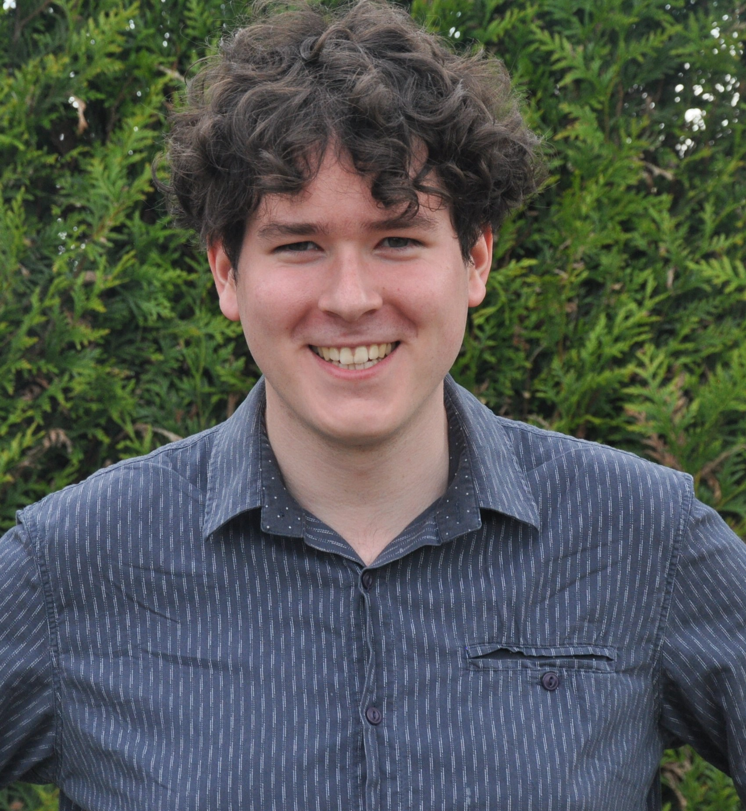

# Jorn Van de Velde

Welcome to my personal github site!

I'm a PhD researcher at the [Hydro-Climate Extremes Lab](https://www.ugent.be/bw/environment/en/research/h-cel), where I study the use of stochastic models to assess the impact of climate change on hydrologic extremes.

## Papers

[Exploring the Effect of Occurrence-Bias-Adjustment Assumptions on Hydrological Impact Modeling](https://doi.org/10.3390/w13111573)

## Contact & links

- [Mail](jorn.vandevelde@ugent.be)
- [Google Scholar](https://scholar.google.com/citations?user=rH0j4nYAAAAJ&hl=nl)
- [Twitter](https://twitter.com/JornVelde)
- [Researchgate](https://www.researchgate.net/profile/Jorn-Van-De-Velde)
- [LinkedIn](https://www.linkedin.com/in/jorn-van-de-velde-b97057146/)
